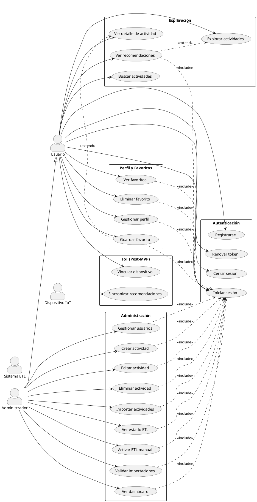

# Diagrama de Casos de Uso — Triqueta Digital

## 1. Actores

- **Usuario (Ciudadano)**
- **Administrador** (hereda de Usuario)
- **Sistema ETL** (actor del sistema, opcional)
- **Dispositivo IoT** (post-MVP, opcional)

---

## 2. Casos de Uso por Actor

### 2.1 Usuario (Ciudadano)
- **Registrarse en el sistema** (RF-001)
- **Iniciar sesión** (RF-002)
- **Renovar token** (RF-003)
- **Cerrar sesión** (RF-004)
- **Gestionar mi perfil** (RF-005)
  - Ver perfil
  - Editar perfil (nombre, foto, intereses, disponibilidad, localidad)
- **Explorar actividades** (RF-006)
  - Filtros: tipo, localidad, fechas, precio, nivel, etiquetas
- **Buscar actividades** (RF-008)
- **Ver detalle de actividad** (RF-007)
- **Guardar actividad como favorito** (RF-011)
- **Ver mis favoritos** (RF-012)
- **Eliminar favorito** (RF-013)
- **Ver recomendaciones personalizadas** (RF-014)
- (Post-MVP) **Vincular dispositivo IoT** (RF-019)

### 2.2 Administrador
- Incluye todos los casos del **Usuario**
- **Crear actividad** (RF-009)
- **Editar actividad** (RF-009)
- **Eliminar actividad (soft delete)** (RF-009)
- **Importar actividades manualmente (CSV/JSON)** (RF-010)
- **Ver estado de ingesta ETL** (RF-016)
- **Activar proceso ETL manual** (RF-017)
- **Validar actividades importadas** (RF-018)
  - Aprobar / Rechazar / Editar y aprobar
- **Ver dashboard administrativo** (RF-021)
- (Baja prioridad) **Gestionar usuarios** (RF-022)

### 2.3 Dispositivo IoT (post-MVP)
- **Sincronizar recomendaciones** (RF-020)
  - Obtener top 3–5 recomendaciones del usuario vinculado

### 2.4 Sistema ETL (actor del sistema, opcional)
- Interacciona con los casos del Administrador relacionados con ingesta (RF-016, RF-017, RF-018)

---

## 3. Relaciones UML

- **Generalización:**
  - Administrador → Usuario

- **Include (<<include>>):**
  - Gestionar mi perfil <<include>> Iniciar sesión
  - Guardar/Ver/Eliminar favorito <<include>> Iniciar sesión
  - Ver recomendaciones <<include>> Iniciar sesión
  - Crear/Editar/Eliminar actividad <<include>> Iniciar sesión
  - Importar actividades <<include>> Iniciar sesión
  - Ver dashboard <<include>> Iniciar sesión
  - Ver estado ETL / Activar ETL / Validar importaciones <<include>> Iniciar sesión

- **Extend (<<extend>>):**
  - Ver recomendaciones <<extend>> Explorar actividades (opcional al flujo de exploración)
  - Guardar favorito <<extend>> Ver detalle de actividad

---

## 4. Agrupación por Paquetes (Packages)

- **Autenticación**: Registrarse, Iniciar sesión, Renovar token, Cerrar sesión
- **Perfil y Favoritos**: Gestionar perfil, Guardar/Ver/Eliminar favorito
- **Exploración**: Explorar actividades, Buscar actividades, Ver detalle, Ver recomendaciones
- **Administración**: CRUD actividades, Importar actividades, Dashboard, Gestión ETL, Gestión de usuarios
- **IoT (Post-MVP)**: Vincular dispositivo, Sincronizar recomendaciones

---

## 5. Priorización (MVP vs Post-MVP)

- **Alta prioridad (MVP Core):** RF-001 a RF-014
- **Media prioridad (MVP Extendido):** RF-015 a RF-018, RF-021
- **Baja prioridad (Post-MVP):** RF-019, RF-020, RF-022

---

## 6. Trazabilidad rápida (Caso de uso → RF)

- Autenticación y perfil → RF-001, RF-002, RF-003, RF-004, RF-005
- Exploración y búsqueda → RF-006, RF-007, RF-008
- Favoritos → RF-011, RF-012, RF-013
- Recomendaciones → RF-014, RF-015
- ETL / Admin → RF-016, RF-017, RF-018, RF-021, RF-022
- IoT → RF-019, RF-020

---

## 7. Plantilla para Dibujar el Diagrama (PlantUML)

Puedes pegar este bloque en cualquier visor de PlantUML:

---

## 8. Notas de modelado

- Usa líneas continuas para asociación actor → caso de uso.
- Usa flecha abierta para generalización (Administrador hereda de Usuario).
- Usa líneas punteadas con <<include>> y <<extend>> para dependencias y extensiones.
- Marca los casos post-MVP (IoT, gestión avanzada de usuarios) si el diagrama se enfoca al MVP.

---

## 9. Referencias internas

- `docs/SRS.md`
- `docs/SRS_Requisitos_Funcionales.md`
- `docs/SRS_Requisitos_No_Funcionales.md`
- `docs/SRS_Arquitectura_y_Datos.md`
