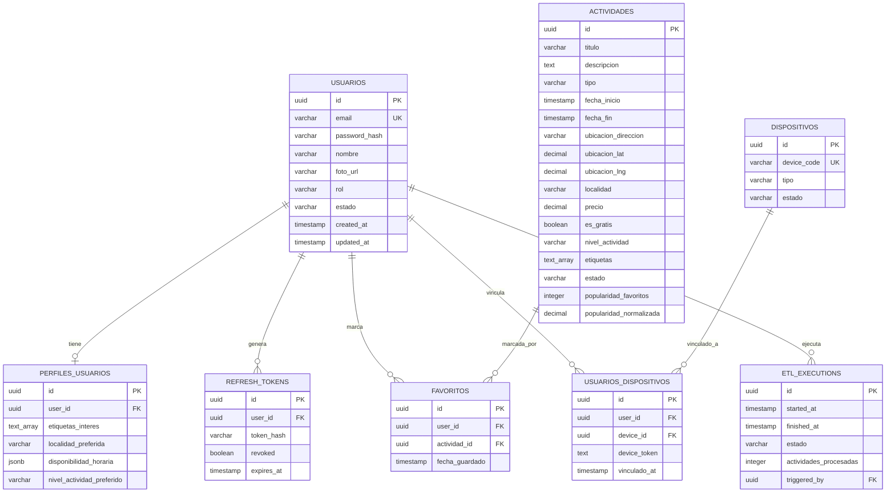

# Modelo Relacional - Triqueta Digital

**Versión:** 1.0  
**Fecha:** Octubre 2025  
**Base de Datos:** PostgreSQL 15+

---

## Tabla de Contenidos

1. [Diagrama Entidad-Relación](#1-diagrama-entidad-relación)
2. [Entidades Principales](#2-entidades-principales)
3. [Descripción de Tablas](#3-descripción-de-tablas)
4. [Relaciones](#4-relaciones)
5. [Índices](#5-índices)
6. [Constraints](#6-constraints)

---

## 1. Diagrama Entidad-Relación

### 1.1 Diagrama Mermaid (ERD)



---

## 2. Entidades Principales

| Entidad | Descripción | Tipo | Prioridad |
|---------|-------------|------|-----------|
| **usuarios** | Cuentas de usuarios (ciudadanos y administradores) | Core | ⭐ Alta |
| **perfiles_usuarios** | Preferencias y configuración de usuarios | Core | ⭐ Alta |
| **actividades** | Eventos culturales, deportivos y recreativos | Core | ⭐ Alta |
| **favoritos** | Relación muchos-a-muchos entre usuarios y actividades | Core | ⭐ Alta |
| **refresh_tokens** | Tokens de autenticación para renovación | Core | ⭐ Alta |
| **etl_executions** | Logs de procesos de ingesta de datos | Support | 🟡 Media |
| **dispositivos** | Hardware IoT (cubos físicos) | IoT | 🔵 Post-MVP |
| **usuarios_dispositivos** | Vinculación usuario-dispositivo | IoT | 🔵 Post-MVP |

---

## 3. Descripción de Tablas

### 3.1 `usuarios`

Almacena información de autenticación y datos básicos de usuarios.

| Campo | Tipo | Restricciones | Descripción |
|-------|------|---------------|-------------|
| `id` | UUID | PRIMARY KEY | Identificador único |
| `email` | VARCHAR(255) | NOT NULL, UNIQUE | Email del usuario |
| `password_hash` | VARCHAR(255) | NOT NULL | Hash bcrypt de la contraseña |
| `nombre` | VARCHAR(255) | NOT NULL | Nombre completo |
| `foto_url` | VARCHAR(500) | NULL | URL de la foto de perfil |
| `rol` | VARCHAR(50) | DEFAULT 'usuario' | 'usuario' o 'administrador' |
| `estado` | VARCHAR(50) | DEFAULT 'activo' | 'activo', 'inactivo', 'suspendido' |
| `created_at` | TIMESTAMP WITH TIME ZONE | DEFAULT NOW() | Fecha de creación |
| `updated_at` | TIMESTAMP WITH TIME ZONE | DEFAULT NOW() | Última actualización |

---

### 3.2 `perfiles_usuarios`

Preferencias y configuración personalizada de usuarios.

| Campo | Tipo | Restricciones | Descripción |
|-------|------|---------------|-------------|
| `id` | UUID | PRIMARY KEY | Identificador único |
| `user_id` | UUID | FK → usuarios(id), ON DELETE CASCADE | Usuario asociado |
| `etiquetas_interes` | TEXT[] | NULL | Array de etiquetas de interés |
| `localidad_preferida` | VARCHAR(100) | NULL | Localidad preferida |
| `disponibilidad_horaria` | JSONB | NULL | Horarios de disponibilidad |
| `nivel_actividad_preferido` | VARCHAR(50) | NULL | 'bajo', 'medio', 'alto' |

---

### 3.3 `actividades`

Catálogo de actividades culturales, deportivas y recreativas.

| Campo | Tipo | Restricciones | Descripción |
|-------|------|---------------|-------------|
| `id` | UUID | PRIMARY KEY | Identificador único |
| `titulo` | VARCHAR(255) | NOT NULL | Título de la actividad |
| `descripcion` | TEXT | NOT NULL | Descripción completa |
| `tipo` | VARCHAR(50) | NOT NULL | 'cultura', 'deporte', 'recreacion' |
| `fecha_inicio` | TIMESTAMP WITH TIME ZONE | NOT NULL | Fecha/hora de inicio |
| `fecha_fin` | TIMESTAMP WITH TIME ZONE | NULL | Fecha/hora de fin |
| `ubicacion_direccion` | VARCHAR(500) | NOT NULL | Dirección física |
| `ubicacion_lat` | DECIMAL(10, 8) | NOT NULL | Latitud GPS |
| `ubicacion_lng` | DECIMAL(11, 8) | NOT NULL | Longitud GPS |
| `localidad` | VARCHAR(100) | NOT NULL | 'Chapinero', 'Santa Fe', 'La Candelaria' |
| `precio` | DECIMAL(10, 2) | DEFAULT 0 | Precio de entrada |
| `es_gratis` | BOOLEAN | DEFAULT TRUE | Si es gratuita |
| `nivel_actividad` | VARCHAR(50) | NULL | 'bajo', 'medio', 'alto' |
| `etiquetas` | TEXT[] | NOT NULL | Array de etiquetas |
| `contacto` | VARCHAR(255) | NULL | Información de contacto |
| `enlace_externo` | VARCHAR(500) | NULL | URL externa |
| `fuente` | VARCHAR(100) | DEFAULT 'manual' | Fuente de datos |
| `estado` | VARCHAR(50) | DEFAULT 'activa' | 'activa', 'inactiva', 'pendiente_validacion', 'rechazada' |
| `popularidad_favoritos` | INTEGER | DEFAULT 0 | Contador de favoritos |
| `popularidad_vistas` | DECIMAL(10, 2) | DEFAULT 0 | Contador de vistas |
| `popularidad_normalizada` | DECIMAL(5, 4) | DEFAULT 0 | Score normalizado 0-1 |

---

### 3.4 `favoritos`

Relación muchos-a-muchos entre usuarios y actividades favoritas.

| Campo | Tipo | Restricciones | Descripción |
|-------|------|---------------|-------------|
| `id` | UUID | PRIMARY KEY | Identificador único |
| `user_id` | UUID | FK → usuarios(id), ON DELETE CASCADE | Usuario |
| `actividad_id` | UUID | FK → actividades(id), ON DELETE CASCADE | Actividad |
| `fecha_guardado` | TIMESTAMP WITH TIME ZONE | DEFAULT NOW() | Fecha en que se guardó |

**Constraint**: UNIQUE(user_id, actividad_id)

---

### 3.5 `refresh_tokens`

Almacena refresh tokens para autenticación.

| Campo | Tipo | Restricciones | Descripción |
|-------|------|---------------|-------------|
| `id` | UUID | PRIMARY KEY | Identificador único |
| `user_id` | UUID | FK → usuarios(id), ON DELETE CASCADE | Usuario asociado |
| `token_hash` | VARCHAR(255) | NOT NULL | Hash del refresh token |
| `revoked` | BOOLEAN | DEFAULT FALSE | Si está revocado |
| `expires_at` | TIMESTAMP WITH TIME ZONE | NOT NULL | Fecha de expiración |

---

### 3.6 `etl_executions`

Logs de ejecuciones del proceso ETL.

| Campo | Tipo | Restricciones | Descripción |
|-------|------|---------------|-------------|
| `id` | UUID | PRIMARY KEY | Identificador único |
| `started_at` | TIMESTAMP WITH TIME ZONE | DEFAULT NOW() | Fecha/hora de inicio |
| `finished_at` | TIMESTAMP WITH TIME ZONE | NULL | Fecha/hora de finalización |
| `estado` | VARCHAR(50) | DEFAULT 'corriendo' | 'corriendo', 'exitoso', 'error' |
| `actividades_procesadas` | INTEGER | DEFAULT 0 | Total procesadas |
| `actividades_exitosas` | INTEGER | DEFAULT 0 | Total exitosas |
| `actividades_errores` | INTEGER | DEFAULT 0 | Total con errores |
| `error_log` | TEXT | NULL | Log de errores |
| `triggered_by` | UUID | FK → usuarios(id), NULL | Admin que ejecutó |

---

### 3.7 `dispositivos` (Post-MVP)

Catálogo de dispositivos IoT (cubos).

| Campo | Tipo | Restricciones | Descripción |
|-------|------|---------------|-------------|
| `id` | UUID | PRIMARY KEY | Identificador único |
| `device_code` | VARCHAR(50) | NOT NULL, UNIQUE | Código único del dispositivo |
| `tipo` | VARCHAR(50) | DEFAULT 'cubo' | Tipo de dispositivo |
| `estado` | VARCHAR(50) | DEFAULT 'disponible' | 'disponible', 'vinculado', 'inactivo' |

---

### 3.8 `usuarios_dispositivos` (Post-MVP)

Vinculación entre usuarios y dispositivos IoT.

| Campo | Tipo | Restricciones | Descripción |
|-------|------|---------------|-------------|
| `id` | UUID | PRIMARY KEY | Identificador único |
| `user_id` | UUID | FK → usuarios(id), ON DELETE CASCADE | Usuario |
| `device_id` | UUID | FK → dispositivos(id), ON DELETE CASCADE | Dispositivo |
| `device_token` | TEXT | NULL | JWT del dispositivo |
| `vinculado_at` | TIMESTAMP WITH TIME ZONE | DEFAULT NOW() | Fecha de vinculación |
| `desvinculado_at` | TIMESTAMP WITH TIME ZONE | NULL | Fecha de desvinculación |

---

## 4. Relaciones

| Relación | Cardinalidad | FK | ON DELETE |
|----------|--------------|-----|-----------|
| usuarios → perfiles_usuarios | 1:1 | perfiles_usuarios.user_id | CASCADE |
| usuarios → refresh_tokens | 1:N | refresh_tokens.user_id | CASCADE |
| usuarios → favoritos | 1:N | favoritos.user_id | CASCADE |
| actividades → favoritos | 1:N | favoritos.actividad_id | CASCADE |
| usuarios → etl_executions | 1:N | etl_executions.triggered_by | SET NULL |
| usuarios → usuarios_dispositivos | 1:N | usuarios_dispositivos.user_id | CASCADE |
| dispositivos → usuarios_dispositivos | 1:N | usuarios_dispositivos.device_id | CASCADE |

---

## 5. Índices

### 5.1 Índices Principales

**usuarios**:
- PRIMARY KEY en `id`
- UNIQUE INDEX en `email`
- INDEX en `rol`, `estado`

**perfiles_usuarios**:
- PRIMARY KEY en `id`
- UNIQUE INDEX en `user_id`
- GIN INDEX en `etiquetas_interes`

**actividades**:
- PRIMARY KEY en `id`
- INDEX en `localidad`, `tipo`, `fecha_inicio`, `estado`
- GIN INDEX en `etiquetas`
- INDEX en `popularidad_normalizada DESC`

**favoritos**:
- PRIMARY KEY en `id`
- INDEX en `user_id`, `actividad_id`
- UNIQUE INDEX en `(user_id, actividad_id)`

**refresh_tokens**:
- PRIMARY KEY en `id`
- INDEX en `user_id`, `token_hash`, `expires_at`

---

## 6. Constraints

### 6.1 Check Constraints

**usuarios**:
```sql
CHECK (rol IN ('usuario', 'administrador'))
CHECK (estado IN ('activo', 'inactivo', 'suspendido'))
CHECK (email ~* '^[A-Za-z0-9._%+-]+@[A-Za-z0-9.-]+\.[A-Za-z]{2,}$')
```

**actividades**:
```sql
CHECK (tipo IN ('cultura', 'deporte', 'recreacion'))
CHECK (localidad IN ('Chapinero', 'Santa Fe', 'La Candelaria'))
CHECK (nivel_actividad IN ('bajo', 'medio', 'alto') OR nivel_actividad IS NULL)
CHECK (estado IN ('activa', 'inactiva', 'pendiente_validacion', 'rechazada'))
CHECK (precio >= 0)
CHECK (ubicacion_lat >= -90 AND ubicacion_lat <= 90)
CHECK (ubicacion_lng >= -180 AND ubicacion_lng <= 180)
CHECK (fecha_fin IS NULL OR fecha_fin >= fecha_inicio)
```

---

## 7. Scripts SQL

Ver archivos:
- `schema.sql` - Script completo de creación de tablas
- `indexes.sql` - Script de índices
- `seed.sql` - Datos de prueba

---

## 8. Referencias

- `docs/SRS.md`
- `docs/SRS_Arquitectura_y_Datos.md`
- `docs/SRS_Requisitos_Funcionales.md`
